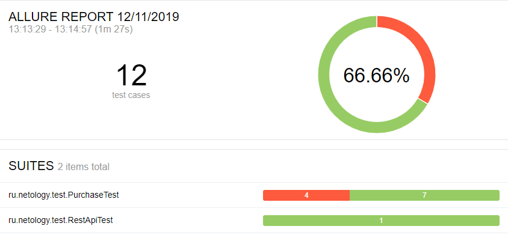

# Отчет по итогам тестирования

### Краткое описание

Автоматизация тестирования сервиса "Покупка тура" выполнялась с использованием следующих инструментов:

* Java 8
* junit-jupiter: 5.5.1
* selenide: 5.3.1
* rest-assured: 4.1.2
* allure 2.13.0

Для работы с БД и симулятором банковских сервисов использовался docker

Были протестированы сценарии:
* успешная покупка с дебетовой и кредитной карты
* отказ банка с дебетовой и кредитной картой
* негативные проверки полей: невалидные значения, незаполненные поля

### Количество тест-кейсов

* Всего: 12 тест-кейсов
* Успешных: 8 (67%)
* Неуспешных: 4 (33%)

### Общие рекомендации